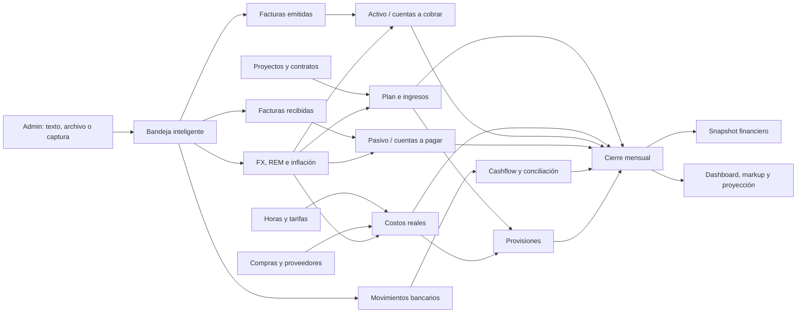

# Carga financiera/económica directa en Mind

**Fecha del relevamiento:** 2026-09-10

**Fuente funcional:** `Seguimiento Financiero_Economico.xlsx`, en particular `Instructivo`, `Activo`, `Pasivo`, `CashFlow`, `Costos directos e indirectos`, `Costos estimados`, `Proyectos confirmados y estimad`, `Resumen Ejecutivo`, `Rendimiento Cliente`, `Valor Hora Real y Estimada`, `Horas Asignadas` e `Info Tipo de Cambio y REM`.

**Objetivo:** que Mind sea la fuente de verdad desde una fecha de corte, sin depender de cargar primero el Excel.

## 1. Conclusión ejecutiva

No hay que reproducir las 54 pestañas del Excel dentro de Mind. El libro analizado contiene unas 145.000 celdas con contenido, más de 31.000 fórmulas y 103 validaciones; combina cuatro cosas distintas:

1. datos fuente que una persona carga o confirma;
2. maestros y reglas de clasificación;
3. cálculos, tablas dinámicas y reportes derivados;
4. copias históricas, auxiliares y backups.

En Mind sólo deben escribirse las categorías 1 y 2. Todo lo demás debe calcularse de forma determinística desde la base de datos y, al cerrar un mes, congelarse como un snapshot auditable.

Mind ya tiene gran parte de la infraestructura: proyectos, horas, cierres mensuales de personas, tarifas históricas, cotizaciones, tipo de cambio, inflación, ventas/facturación por proyecto y tablas de Activo, Pasivo, Cashflow y Provisiones. La brecha principal es completar y unificar el circuito de escritura, agregar el cierre financiero del período y reemplazar los ETL que todavía leen Excel para construir costos, ingresos y `monthly_financial_summary`.

Estimación funcional de automatización:

| Escenario | Automatización alcanzable | Qué queda manual |
|---|---:|---|
| Operación 100% nativa en Mind, sin conexiones bancarias/de facturación | **70–80%** del proceso mensual | registrar en Mind los hechos externos que Mind no puede conocer, resolver excepciones y aprobar el cierre |
| Mind + conexiones automáticas con bancos, facturación, Asana y fuentes financieras | **85–90%** | decisiones contables, matching ambiguo y aprobación final |
| Cálculos, pivots, auxiliares, markup, resumen y controles | **95–100%** | sólo resolver alertas o aprobar excepciones |

Los porcentajes son una estimación del trabajo operativo del instructivo, no una promesa de reducción de tiempo. Si un sistema externo no ofrece conexión automática, el hecho se registra en el módulo correspondiente de Mind; no se usa CSV como parte del flujo mensual.

### Alcance explícito de la solución

- Toda la operación posterior al cutover se realiza dentro de Mind.
- No hay formularios externos, planillas intermedias ni importaciones CSV mensuales.
- “Pantalla de carga” significa una acción nativa dentro del objeto que se está gestionando: emitir factura desde el proyecto, registrar pago desde el Pasivo, registrar un movimiento desde Tesorería o aprobar una provisión desde el cierre.
- Cuando Mind ya posee el dato —proyecto, horas, tarifa, fee o condición de pago— lo reutiliza y genera el registro; no vuelve a pedirlo.
- Cuando el dato nace fuera de Mind, entra por una conexión automática. Si no existe esa conexión, una persona registra sólo ese hecho en Mind.
- La única importación desde Excel es el backfill técnico e irrepetible del histórico anterior al cutover. No queda disponible como proceso operativo normal.

### Bandeja Financiera inteligente

Para que Admin no tenga que completar pantallas extensas, Mind debe ofrecer un único punto de entrada: **Cargar información financiera**. Desde ahí se puede:

- escribir o pegar texto libre;
- adjuntar uno o varios archivos;
- arrastrar un PDF, comprobante o extracto;
- subir o pegar una captura de pantalla;
- reenviar contenido recibido por otro canal, si más adelante se habilita esa conexión.

Mind clasifica cada elemento y propone el destino: Activo, Pasivo, Cashflow, factura/cobranza de proyecto, provisión, impuesto, FX o costo. La interfaz no pide que Admin sepa en qué tabla va cada campo.

Flujo de la bandeja:

1. Admin pega el texto o adjunta la evidencia.
2. Mind detecta el tipo de documento/operación.
3. OCR y extracción estructurada leen fechas, partes, moneda, importes, impuestos, número de documento, cuenta, proyecto y concepto.
4. Mind cruza clientes, razones sociales, proveedores, proyectos y aliases existentes.
5. Aplica reglas de FX, IVA, vencimiento, costo directo/indirecto y período.
6. Muestra un borrador al lado de la fuente original y resalta únicamente lo ambiguo o faltante.
7. Admin confirma, corrige o descarta.
8. Mind crea los registros canónicos, vincula el archivo original y recalcula el período.

Ejemplos de texto que debería entender:

- “Pagamos la factura 123 de Itecsa por $1.210.000 el 8/9 desde Santander; corresponde a agosto”.
- “Warner confirmó el fee de octubre por USD 8.000, factura a fin de mes y paga a 90 días”.
- “Este comprobante es un cobro parcial de PepsiCo para la factura 845”.

Una sola carga puede producir varios efectos vinculados, dentro de una única transacción:

| Evidencia recibida | Registros que Mind propone |
|---|---|
| Factura emitida a cliente | factura + cuenta por cobrar/Activo + evento de ingreso |
| Comprobante de cobro | aplicación a factura + movimiento Cashflow + nuevo saldo pendiente |
| Factura de proveedor | cuenta por pagar/Pasivo + costo/impuesto según reglas |
| Comprobante de pago | aplicación al Pasivo + movimiento Cashflow |
| Extracto bancario | movimientos + conciliaciones + saldo de cuenta |
| Confirmación de fee/hito | plan de ingreso + facturación/cobranza esperadas |
| Captura de cotización | candidato de FX con fuente/fecha; requiere aprobación |
| Liquidación impositiva | obligación impositiva + costo/provisión + vencimiento |

Admin confirma la operación de negocio, no cada fila técnica que Mind necesita crear por detrás.

La extracción asistida no debe publicar silenciosamente datos contables. Puede autocompletar y recomendar; Admin confirma antes de afectar el ledger, salvo conexiones y reglas expresamente autorizadas para contabilización automática.

Datos mínimos de la bandeja:

- tipo de entrada: texto, archivo, imagen o conexión;
- contenido/archivo original inmutable, hash y ubicación segura;
- tipo y destino sugeridos;
- payload extraído, versión del extractor y confianza por campo;
- errores, advertencias y campos pendientes;
- estado: recibido, procesando, requiere revisión, aprobado, rechazado o contabilizado;
- usuario que cargó, usuario que aprobó y timestamps;
- IDs de los registros creados para navegar de la evidencia al asiento y viceversa.

Controles obligatorios:

- detectar duplicados por hash, número, contraparte, importe y fecha;
- validar que subtotales, impuestos y total cierren;
- exigir confirmación de moneda, signo, período y contraparte cuando haya ambigüedad;
- no permitir escribir en períodos cerrados;
- conservar el documento original y todas las correcciones;
- escanear adjuntos y no ejecutar contenido incluido en archivos;
- almacenar comprobantes en un repositorio privado, cifrado y con URLs temporales; nunca bajo una ruta pública;
- respetar permisos de Finanzas y la confidencialidad del comprobante;
- registrar qué extracción/modelo produjo cada sugerencia;
- permitir procesamiento masivo, pero aprobación por lote sólo cuando no haya alertas.

## 2. Principio de arquitectura

Reglas estructurales:

- Una operación se carga una sola vez y conserva moneda y monto originales.
- La conversión a USD usa una cotización versionada y guarda el snapshot aplicado.
- Facturación, devengado y cobranza son fechas/bases diferentes; no deben colapsarse en un único campo.
- Un período abierto se recalcula. Un período cerrado no cambia silenciosamente.
- Reabrir exige permiso, motivo y registro de auditoría.
- Los reportes no son fuentes de datos. `Resumen Ejecutivo`, markup y tableros se derivan.
- Una corrección se hace sobre el dato fuente o mediante ajuste/anulación, nunca editando el total del dashboard.

## 3. Qué representa cada grupo del Excel

### 3.1 Datos que sí deben tener carga nativa

| Grupo | Pestañas de origen | Destino funcional en Mind |
|---|---|---|
| Activos y cuentas a cobrar | `Activo` | Documentos por cobrar, saldos líquidos/inversiones y cobros aplicados |
| Pasivos y cuentas a pagar | `Pasivo` | Documentos por pagar, pagos parciales/totales y vencimientos |
| Tesorería | `CashFlow` | Cuentas financieras, movimientos, transferencias y conciliación |
| Costos reales | `Costos directos e indirectos` | Horas × tarifa más gastos no laborales, con asignación a proyecto/categoría |
| Costos proyectados | `Costos estimados` | Plantillas/schedules de costos futuros; luego hechos mensuales derivados |
| Ventas y proyección | `Proyectos confirmados y estimad` | Plan de ingresos, facturas, devengamiento, cobranza esperada y pipeline |
| Provisiones | `Provisión pasivo`, parte de `Impuestos` | Provisión, altas, recuperos/liberaciones, saldo y aprobación |
| Impuestos | `Impuestos` | Reglas y liquidación mensual de IVA, IIBB, impuesto USA y honorarios contables |
| Valores financieros | `Info Tipo de Cambio y REM`, `Calculo ajustes` | FX real/estimado, REM, inflación real/proyectada y versiones |
| Costos de personas | `Valor Hora Real y Estimada` | Tarifas/costos históricos por persona y período |
| Staffing objetivo | `Horas Asignadas` | Plan normalizado persona–proyecto–período–horas |
| Regla excepcional | `Intereses Oxean` | Préstamo/saldo e intereses o, como mínimo, ajuste financiero programado |

### 3.2 Maestros y reglas

`Listas` y `Clasificaciones` deben migrarse a maestros administrables:

- clientes y razones sociales;
- proyectos y tipo de proyecto (`Fee`, `One Shot`, interno u otros);
- proveedores/personas y alias de origen;
- conceptos y subtipos de activo, pasivo, costo y movimiento;
- reglas de costo directo/indirecto;
- bancos, billeteras y cuentas;
- roles/puestos;
- condiciones de pago;
- tratamiento impositivo por proveedor/categoría;
- exclusiones del pase Pasivo → Costos;
- aliases históricos para que el backfill inicial y las conexiones automáticas no dependan de coincidencias de texto.

### 3.3 Datos que no se deben cargar

Las siguientes pestañas son salidas o mecanismos internos del Excel y deben desaparecer como pasos operativos:

- `Activos Aux`, `Pasivos Aux`;
- `Resumen Ejecutivo`;
- `TD Costos para CIERRE`, `TD Seguimiento y control`;
- `Rendimiento Cliente`;
- `TD Costos para seguimiento MARK`, `TD Proyectos confirmados y esti`, `TD Costos Estimados para proyec`;
- `Seguimiento Mark Up General` y todas las pestañas `Seguimiento Mark Up <cliente>`;
- `Formulas`, `Formulas total Pas y Act`, `Anexo posib`.

Mind debe ofrecer las vistas equivalentes, alimentadas directamente por las entidades canónicas.

### 3.4 Histórico/archivo que no debe convertirse en funcionalidad

- `ACTIVO BACK UP 5-9 previo cambi`;
- `PASIVO BACK UP 8-9 PREVIO CAMBI`;
- `Activo retro MICH`, `Pasivo Retro MICH`;
- `Datos64-2025-01 ene`, `Datos63-2026-08 ago`, `Datos62-2026-08 ago`, `Datos65-2026-08 ago`.

Se conservan como evidencia histórica fuera del flujo nuevo. Si contienen períodos no presentes en la base, se importan una sola vez con trazabilidad de archivo, pestaña y fila.

## 4. Diccionario mínimo de carga

### 4.1 Período y cierre financiero

Entidad nueva sugerida: `financial_close_periods`.

| Campo | Regla |
|---|---|
| `period_key` | `YYYY-MM`, único |
| `status` | `OPEN`, `PRE_CLOSE`, `IN_REVIEW`, `CLOSED`, `REOPENED` |
| `official_fx_rate_id` | FX aprobado para el cierre |
| `started_at/by`, `closed_at/by` | auditoría |
| `reopened_at/by/reason` | obligatorio al reabrir |
| `checklist_version` | versión de reglas usada |
| `notes` | observaciones del cierre |

Debe existir además una tabla de checks del período: check, severidad, resultado, diferencia, responsable, evidencia, estado y resolución.

### 4.2 Activo: documentos por cobrar y saldos

Campos del Excel que se conservan: concepto/banco, tipo de activo, cliente, período, estado al cierre, fecha de pago/NC, fecha de facturación, número de factura, razón social, detalle, vencimiento, ARS, USD y cotización.

Campos que faltan para operar correctamente en Mind:

- `project_id` y `billing_entity_id`;
- `document_type`: factura, nota de crédito, saldo de cuenta, inversión, cripto;
- monto neto, IVA, IIBB/percepciones y total bruto;
- `currency`, `original_amount`, `fx_rate_id`, `normalized_usd`;
- estado explícito: borrador, emitido, parcial, cobrado, vencido, anulado;
- `outstanding_amount` y aplicaciones de cobro por separado;
- `source`, `external_id`, archivo/comprobante y clave de idempotencia;
- creador, modificador, timestamps y bitácora.

Los activos líquidos (bancos, caja, cripto) no deberían fingirse como facturas. Conviene separarlos como saldos de cuenta al cierre o derivarlos de movimientos conciliados y balances iniciales.

### 4.3 Pasivo: documentos por pagar

Campos del Excel que se conservan: proveedor/detalle, subtipo, período de costo, estado de pago, fechas de emisión/pago/vencimiento, concepto, descripción/factura, ARS, USD, cotización y vencido.

Campos/reglas necesarios:

- `vendor_id`/`personnel_id`, documento y razón social;
- período de devengamiento separado del período de factura y pago;
- proyecto/cliente y distribución porcentual cuando es costo directo;
- neto, IVA, percepciones y total;
- estados `PENDING`, `PARTIAL`, `PAID`, `OVERDUE`, `VOID`;
- saldo pendiente y aplicaciones de pago;
- regla de tratamiento: directo, indirecto, provisión o excluido;
- regla de IVA recuperable/no recuperable;
- adjunto, fuente, external ID e idempotencia;
- auditoría completa.

La tabla actual reduce el estado a un booleano `pagado_al_cierre`; eso no cubre “Pagado Parcial”.

### 4.4 Cashflow y conciliación

Cada movimiento necesita:

- cuenta financiera, fecha valor y fecha de registración;
- ingreso, egreso o transferencia;
- moneda y monto originales;
- FX aplicado y monto USD normalizado;
- contraparte, cliente/proveedor/proyecto opcionales;
- concepto y detalle;
- referencia bancaria/externa estable;
- estado de conciliación y vínculo a factura/pago/cobro;
- origen/conexión, referencia externa, autor y timestamps.

Las transferencias entre cuentas propias se modelan como dos patas vinculadas para no inflar ingresos/egresos. Los saldos Santander/BOA/Caja deben calcularse desde balance inicial + movimientos conciliados, y compararse contra el extracto. No son campos editables por fila.

### 4.5 Ingresos: plan, factura, devengado y cobranza

Por cliente/proyecto se requiere:

- modalidad: Fee, One Shot, T&M/milestone u otra;
- confirmado, propuesta enviada, probabilidad y estado;
- período de facturación;
- ventana/curva de prestación para devengado;
- período esperado y real de cobro;
- términos de pago;
- monto base, ajuste, moneda, IVA, IIBB y FX;
- factura y cobranza vinculadas;
- proyección vs. real, con versionado.

Mind ya tiene piezas superpuestas (`project_monthly_sales`, `project_financial_transactions`, `project_monthly_revenue` y `revenue_events`). Antes de ampliar pantallas hay que declarar una fuente canónica y convertir las demás en proyecciones/compatibilidad. La recomendación es usar un evento de ingreso con las tres bases temporales y documentos de factura/cobro vinculados; no seguir escribiendo cuatro representaciones independientes.

Reglas a preservar:

- Fee: reconocimiento/cierre mensual;
- One Shot: costo e ingreso acumulados durante la vida del proyecto y cierre único al terminar;
- excepciones como Detroit no deben quedar escondidas en fórmulas: necesitan una política explícita, con vigencia y nota;
- los cambios de precio deben tener fecha de vigencia y no reescribir meses cerrados.

### 4.6 Costos reales

El costo laboral se deriva de:

`horas reales persona–proyecto–período × tarifa histórica vigente`, con snapshot de tarifa y FX al cierre.

Se deben conservar, además:

- horas objetivo, reales y facturables;
- persona/proveedor, rol y tipo de contrato;
- proyecto, cliente y tipo de proyecto;
- directo/indirecto y especificación;
- moneda/monto originales, FX y total USD;
- fuente de horas y de tarifa;
- ajustes aprobados del cierre.

Los gastos no laborales salen de documentos de Pasivo/gastos. La regla Pasivo → Costos se ejecuta automáticamente y genera trazabilidad uno a uno, no una copia desconectada.

Reglas del instructivo que deben parametrizarse:

- excluir Board, Equipo, Oxean y Provisión Pasivo del pase automático cuando corresponda;
- remover IVA (`/ 1,21`) para Itecsa/contabilidad según la política vigente;
- distinguir monotributo de Vicky A y Pau;
- no pasar impuesto USA negativo como costo;
- trabajo de cliente = directo; Epical/interno = indirecto;
- capacidad base 160 h full-time y 120 h part-time, con feriados/ausencias/ajustes;
- nombres recurrentes de proyecto deben resolver por ID y alias, no por texto libre.

### 4.7 Costos estimados y staffing

No se debe cargar directamente una fact table como `fact_estimated_cost_month`. Hace falta una fuente editable:

- plantilla de gasto recurrente: proveedor/categoría, monto, moneda, inicio, fin, frecuencia, ajuste;
- staffing plan: persona/rol, proyecto, período, horas objetivo y escenario;
- provisión impositiva futura;
- escenario base/optimista/pesimista y versión del forecast;
- estado propuesto/aprobado/cancelado.

Los hechos mensuales se regeneran desde estas fuentes y se congelan al cerrar.

### 4.8 Provisiones

Una provisión necesita cabecera y movimientos:

- cliente/proyecto, tipo, criterio/método y responsable;
- importe inicial y moneda;
- altas, ajustes, recuperos/liberaciones y saldo remanente;
- períodos planificados y reales;
- vínculo con factura/ingreso y con costos directos recuperados;
- estado propuesta, aprobada, activa, agotada o anulada;
- aprobador, motivo y auditoría.

El sistema puede proponer automáticamente:

1. recupero negativo desde costos directos reales del proyecto;
2. nueva provisión positiva desde facturación y regla configurada;
3. cronograma de liberación y saldo.

La aprobación del criterio y de una excepción sigue siendo humana.

### 4.9 Impuestos, FX, REM e inflación

Debe distinguirse dato observado de estimación:

- FX mensual real/oficial, FX blue validado y fuente;
- REM por publicación y horizonte, con fecha de descarga;
- inflación real y proyectada;
- regla impositiva con vigencia;
- liquidación mensual: ventas ARG/USA, IVA ventas/compras, IIBB, impuesto USA y honorarios.

Mind ya permite sincronizar Blue, cargar REM en bloque y administrar inflación/FX. Falta integrar esos valores al cierre, exigir aprobación del FX oficial y versionar los supuestos que alimentan el forecast.

## 5. Flujo operativo propuesto

### 5.1 Trabajo continuo durante el mes

1. Comercial/Operaciones crea o actualiza el proyecto y su plan de ingresos.
2. La cotización aceptada propone fee, hitos, ajustes, impuestos y calendario; Finanzas confirma.
3. Personas carga horas en Mind; si Asana continúa siendo el origen, una sincronización automática las crea en Mind con aliases e idempotencia, sin intervención mensual.
4. Finanzas emite o registra facturas desde el proyecto/cliente y registra las recibidas desde proveedor/Pasivo; una conexión puede crearlas automáticamente.
5. Tesorería registra movimientos desde el módulo de cuentas, o una conexión bancaria los crea automáticamente; Mind hace matching con cobros/pagos.
6. Mind recalcula Activo, Pasivo, Cashflow, costos, markup y proyección del período abierto.
7. Las inconsistencias aparecen como tareas, no como celdas silenciosamente distintas.

### 5.2 Pre-cierre automático

Al pasar el período a `PRE_CLOSE`, Mind ejecuta:

- control de FX real y REM;
- horas faltantes/duplicadas y personas sin tarifa;
- proyectos activos sin plan de ingresos u horas objetivo;
- facturas sin cliente/proyecto/moneda/FX;
- cobros/pagos sin conciliar;
- documentos vencidos;
- Pasivo vs. costo generado;
- Activo/facturación vs. ingreso;
- saldos por cuenta vs. extracto;
- provisiones propuestas y liberaciones;
- impuestos y gastos estimados futuros;
- comparación contra mes anterior y forecast.

Los checks críticos bloquean el cierre; los warnings pueden aceptarse con comentario.

### 5.3 Revisión humana

Finanzas y responsables revisan sólo excepciones:

- cotización oficial del cierre y cripto;
- diferencias de IVA o timing;
- provisiones nuevas/recuperos;
- pagos parciales, notas de crédito y matches ambiguos;
- ajustes de horas/tarifas;
- reglas especiales de proyectos;
- comentarios del Resumen Ejecutivo.

### 5.4 Cierre y publicación

1. Un responsable de Finanzas solicita cierre.
2. Un segundo responsable o admin aprueba, si se adopta doble control.
3. Mind guarda snapshots de FX, tarifas y agregados; marca fuentes como cerradas.
4. Se reconstruyen en una transacción `fact_rc_month`, `fact_labor_month`, `fact_cost_month` y `monthly_financial_summary` desde datos de Mind.
5. Se publican dashboard, markup por cliente, rendimiento, cashflow y proyección.
6. Cualquier cambio posterior requiere reapertura con motivo y nuevo número de versión.

### 5.5 Trazabilidad contra el instructivo actual

| Paso actual | Resolución objetivo en Mind |
|---|---|
| 1. Pedir Blue/cripto y fecha de validación | tarea automática de pre-cierre, candidatos de fuentes y responsables/fecha |
| 2. Cargar FX en la pestaña | aprobar un registro versionado; la aplicación lo distribuye a todos los cálculos |
| 3. Llevar saldos Santander/BOA de CashFlow a Activo | snapshot automático por cuenta desde movimientos conciliados |
| 4. Validar columnas de Resumen Ejecutivo | checklist con cards, drill-down y comparación contra “Control ADMIN” |
| 5. Armar recupero y nueva provisión | propuesta desde costos directos + facturación/regla; Finanzas aprueba |
| 6. Pasar provisiones a Pasivo | movimiento/asiento vinculado generado al aprobar |
| 7. Revisar consistencia Activo/Pasivo | validaciones automáticas y hallazgos |
| 8. Pasar Pasivo a Costos | motor de reglas con exclusiones, IVA y tratamiento USA |
| 9. Refrescar TD y conciliar | vista siempre actualizada + reporte de diferencias clasificadas |
| 10. Actualizar horas objetivo | staffing plan por persona/proyecto/período, copiable desde plantilla |
| 11. Actualizar markup por cliente | una vista parametrizada; sin copiar tablas ni cambiar el mes en fórmulas |
| 12. Ejecutar Activos/Pasivos Aux | drill-down nativo desde los totales |
| 13. Completar Rendimiento Cliente | P&L automático con política Fee/One Shot y excepciones versionadas |
| 14. Comparar Resumen vs. TD | gate automático del cierre |
| 15. Ajustar Data Studio | vistas BI estables + refresh programado |
| 16. Validación con Tonga | aprobación registrada del cierre |
| 17. Actualizar REM | conexión/parseo automático con bandeja de aprobación; forecast versionado |
| 18. Reemplazar inflación estimada por real | nueva versión de supuesto con preview del impacto |
| 19. Revisar proyectos confirmados/estimados | bandeja mensual de pipeline/forecast con responsables |

El cierre del equipo de los días 20–25 también se absorbe: recordatorios y fechas desde el calendario de cierre; horas desde Mind/Asana; capacidad 160/120 y ausencias desde Personal; ajustes facturables en `monthly_closings`; facturas de personas con snapshot ARS/USD; y handoff/notificaciones dentro del workflow. Los archivos individuales y la tabla dinámica de costos dejan de ser pasos de consolidación.

## 6. Matriz de automatización

| Actividad actual | Objetivo en Mind | Nivel |
|---|---|---:|
| Interpretar textos, facturas, comprobantes y capturas | extracción automática + borrador; Admin confirma sólo campos ambiguos | 80–95% |
| Pedir/validar Blue y cripto | consulta automática a fuentes + candidato; confirmación humana | 80–90% |
| Cargar Blue mensual | persistir automáticamente el valor aprobado | 100% |
| Cargar REM | descargar/parsear publicación BCRA; preview y aprobar | 90–95% |
| Pasar saldos CashFlow → Activo | cálculo por cuenta al cierre | 100% |
| Validar Resumen Ejecutivo | checks con diferencias y drill-down | 90–100% |
| Calcular provisión/recupero | propuesta automática por regla y costos reales | 70–85% |
| Pasar provisiones a Pasivo | asiento/documento vinculado al aprobar | 100% |
| Pasar Pasivo → Costos | motor de clasificación, IVA y exclusiones | 90–100% |
| Horas objetivo | staffing plan; copiar período/plantilla con aprobación | 80–95% |
| Horas reales desde Asana/Mind | sync idempotente y detección de duplicados | 90–100% |
| Markup por cliente | vista desde ingresos y costos canónicos | 100% |
| Rendimiento Cliente | cálculo automático por proyecto/período | 100% |
| Activos/Pasivos Aux | consultas con drill-down | 100% |
| Tablas dinámicas | vistas/materializaciones | 100% |
| Actualizar Data Studio/BI | vistas estables; refresh programado | 95–100% |
| Ajustar inflación y valor hora | aplicar real sobre proyectado, con preview | 80–95% |
| Confirmar proyectos/forecast | sugerir desde pipeline/contratos; decisión humana | 50–75% |
| Reuniones/validación final | checklist y evidencia; aprobación humana | 20–40% |
| Movimientos bancarios | 90–95% con conexión bancaria; registro directo en Mind si no hay conexión | variable |

## 7. Qué existe hoy en Mind y qué falta

| Dominio | Ya existe | Brecha para el corte |
|---|---|---|
| Archivos/IA | carga de PDF/imágenes en otros módulos y SDKs de IA ya instalados | Bandeja Financiera, OCR/extracción estructurada, storage privado, antivirus y revisión humana |
| Horas/costo laboral | time entries, importador Asana, cierre mensual, tarifas históricas y rebuild app → `fact_labor_month` | automatizar la ejecución y generar costo real desde el mismo cierre |
| FX/REM/inflación | CRUD de FX, sincronización Blue, importación REM e inflación | aprobación de cierre, versionado de supuestos y automatizar publicación REM |
| Proyecto/ingresos | UI y CRUD de ventas mensuales y transacciones financieras; `revenue_events` separa bases | elegir SoT, unificar modelos y conectar con hechos/resumen |
| Activo | tabla, importación Excel, API POST/PATCH y listado | alta/edición completa, cobros parciales, impuestos, adjuntos y conciliación |
| Pasivo | tabla, importación Excel, API POST/PATCH y listado | estado parcial, pagos aplicados, impuestos, proyecto/asignación y generación de costos |
| Cashflow | tabla, API, balance calculado y pantalla de consulta | módulo nativo para registrar/matchear movimientos, cuentas canónicas y transferencias |
| Provisiones | tabla, API y formulario simple | cabecera + movimientos + saldo + workflow de aprobación |
| Costos proyectados | fact table importada | fuente editable de templates/schedules y escenarios |
| Dashboard | KPIs, reportes y snapshots | `monthly_financial_summary` sigue viniendo de Excel; falta builder nativo |
| Calidad | hallazgos de calidad y algunos checks | checklist de cierre, gates y resolución con dueño/evidencia |
| Seguridad | permisos en pantallas y varios endpoints | los writes del ledger hoy sólo exigen autenticación; deben exigir Finanzas/admin |

Hay también deuda que debe resolverse antes de abrir la carga a usuarios:

- La infraestructura de adjuntos existente guarda archivos en rutas públicas del servidor; no es apropiada para comprobantes financieros sensibles y debe reemplazarse por storage privado.
- Activo, Pasivo y Cashflow muestran datos pero no ofrecen todavía acciones nativas completas para crear, corregir, aplicar pagos/cobros o anular.
- No hay `DELETE`/anulación uniforme en el ledger; para períodos cerrados debe usarse anulación, no borrado físico.
- Cashflow no guarda `updated_at/by` ni monto USD original separado del normalizado.
- El modelo de Provisiones no representa un ciclo de vida.
- El P&L por cliente del ledger todavía consulta tablas heredadas de Google Sheets/direct costs.
- Hay múltiples modelos de ingresos que pueden divergir.
- El auto-sync sigue leyendo Excel para Resumen, Cashflow, Activo, Pasivo, ingresos y costos; el cutover sólo protege parte de las tablas.
- El Excel contiene al menos una fórmula `#REF!` en la tabla de costos y muchas dependencias por rangos/pestañas específicas. No se deben portar fórmulas literalmente.

## 8. Backlog priorizado

### P0 — obligatorio antes de escribir directamente

1. Construir la Bandeja Financiera MVP para texto, archivos y capturas, con extracción, revisión y trazabilidad.
2. Definir fuente canónica de ingresos y estrategia de compatibilidad para las tablas duplicadas.
3. Crear `financial_close_periods`, checklist, lock/reopen y auditoría.
4. Aplicar permisos `finance`/admin a todas las lecturas sensibles y escrituras del ledger.
5. Completar estados parciales, pagos/cobros aplicados y anulación.
6. Incorporar cuentas financieras, balances iniciales, transferencias y conciliación.
7. Completar los módulos nativos de Activo, Pasivo y Cashflow con acciones contextuales para crear, corregir, conciliar, aplicar pagos/cobros y anular.
8. Construir builders app-native para ingresos, costos y `monthly_financial_summary`.
9. Hacer idempotentes las conexiones automáticas y el backfill histórico; guardar origen, external ID y trazabilidad.
10. Parametrizar reglas Pasivo → Costos, IVA, exclusiones, Fee/One Shot y excepciones.
11. Agregar tests de período anterior/posterior al cutover y de no mutación de meses cerrados.

### P1 — necesario para automatizar el cierre

1. Modelo fuente de gastos recurrentes, costos estimados y staffing.
2. Provisiones con movimientos, saldo y aprobación.
3. Motor de conciliación factura–movimiento y pantalla de excepciones.
4. Liquidación impositiva mensual y proyección.
5. Dashboard de cierre con checks, diferencias y drill-down.
6. Markup/rendimiento general y por cliente sin pestañas específicas.
7. Jobs programados para horas, FX, calidad y rebuild de período abierto.
8. Exportes contables/BI estables.

### P2 — optimización

1. Integraciones bancarias/API y sistema de facturación.
2. Descarga/parseo automático del REM.
3. Reglas de matching aprendibles y sugerencias.
4. Alertas de caja, vencimientos, margen y desvíos de forecast.
5. Escenarios y rolling forecast.

## 9. Migración y cutover

### Fase A — preparación

1. Acordar definiciones de factura, devengado, cobranza, costo directo, provisión y saldo de caja.
2. Asignar un dueño funcional de Finanzas y uno de Operaciones.
3. Elegir el mes de corte y bloquear cambios de estructura en el Excel.
4. Normalizar maestros/aliases y documentar excepciones vigentes.

### Fase B — backfill histórico

1. Importar maestros.
2. Importar fuentes históricas, no reportes derivados.
3. Guardar `source_file`, `source_sheet`, `source_row`, checksum y batch.
4. Importar backups sólo si aportan períodos/filas no presentes en las fuentes principales.
5. Generar desde Mind los hechos y snapshots históricos.

### Fase C — reconciliación

Por cada mes y luego por cliente/proyecto/categoría/cuenta:

- facturación, devengado y cobranza;
- costo directo, indirecto y provisión;
- Activo y Pasivo;
- cash in, cash out y saldo por cuenta;
- impuestos;
- markup y resultado.

Toda diferencia debe quedar clasificada: redondeo, FX, IVA, timing, regla explícita, dato faltante o bug.

### Fase D — paralelo

Ejecutar dos cierres completos en paralelo:

- Excel sigue siendo control, no fuente para el período nuevo;
- Mind produce el cierre y un reporte de diferencias;
- se corrigen reglas/datos en Mind;
- no se agregan fórmulas ad hoc al Excel para “hacer coincidir”.

### Fase E — corte

1. Cerrar y aprobar la última conciliación.
2. Establecer `app_mode_cutover_date`.
3. Desactivar escrituras de Excel para períodos posteriores en **todos** los pipelines, no sólo ledgers/horas.
4. Dejar el Excel histórico en solo lectura.
5. Monitorear el primer cierre exclusivo de Mind y documentar incidentes.
6. Cuando termine el período de garantía, retirar syncs y credenciales de escritura/lectura ya innecesarias.

## 10. Controles de aceptación

No se considera terminado hasta cumplir:

- ningún período cerrado puede mutar sin reapertura registrada;
- todos los writes financieros exigen rol correcto;
- importación repetida del mismo batch no duplica filas;
- pagos/cobros parciales conservan saldo correcto;
- transferencias propias no alteran cash in/out consolidado;
- saldo por cuenta coincide con extracto o tiene diferencia justificada;
- Activo/Pasivo y sus totales tienen drill-down completo;
- cada monto convertido conserva moneda, original, FX, fuente y versión;
- cada registro creado desde la Bandeja conserva su evidencia, extracción, aprobador y vínculo al dato canónico;
- un adjunto duplicado no puede generar dos obligaciones o movimientos;
- ninguna extracción ambigua se contabiliza sin confirmación;
- costos laborales conservan horas, tarifa y FX del cierre;
- los totals de cierre se reconstruyen desde fuentes, no desde Excel ni edición manual;
- no hay hallazgos críticos abiertos;
- reconciliación histórica y dos cierres paralelos aprobados;
- dashboard y BI leen exclusivamente fuentes app-native a partir del corte;
- existe backup/restauración probada y runbook de reapertura.

Tolerancias recomendadas: cero diferencia por documento; hasta USD 0,01 por redondeo a nivel de agregado, salvo una regla de materialidad formalmente aprobada.

## 11. Estimación de implementación

Con la base ya presente en el repositorio, una secuencia razonable para un equipo de una persona full-stack con disponibilidad semanal de Finanzas sería:

| Bloque | Esfuerzo indicativo |
|---|---:|
| Definiciones, modelo canónico y permisos | 3–5 días |
| Bandeja inteligente MVP: texto, archivos, capturas y revisión | 1–2 semanas |
| P0 ledger + cierre + builders nativos | 2–3 semanas |
| P1 provisiones, forecast, impuestos y conciliación | 2–3 semanas |
| Backfill, reconciliación, tests y hardening | 1–2 semanas |
| Integraciones externas P2 | 1–3 semanas adicionales según APIs |

Total técnico indicativo sin integraciones complejas: **7–11 semanas**. El corte productivo requiere además **dos cierres mensuales en paralelo**, por lo que el tiempo calendario es mayor que el esfuerzo de desarrollo.

## 12. Decisiones funcionales que deben quedar cerradas

Estas decisiones no bloquean el diseño, pero sí el cutover:

1. Qué cotización es oficial para cada uso: Blue, MEP, mayorista u otra.
2. Si facturación se registra con total bruto o neto, y cómo se exponen IVA/IIBB.
3. Cuándo un ingreso se devenga para Fee, One Shot y T&M.
4. Quién propone y quién aprueba provisiones y cierre.
5. Política de materialidad y redondeo.
6. Si bancos y facturación ofrecen una conexión automática; de lo contrario, quién registra esos hechos directamente en Mind.
7. Regla formal de Detroit y cualquier otra excepción hoy implícita.
8. Tratamiento de Oxean: préstamo, cuenta corriente o ajuste manual.
9. Años/períodos que se migran con detalle versus sólo snapshot.
10. Retención y acceso a adjuntos/comprobantes.

## 13. Orden recomendado de ejecución

La primera entrega productiva no debería intentar resolver todas las integraciones. El camino de menor riesgo es:

1. seguridad + cierre de período;
2. Bandeja Financiera MVP para texto, archivos y capturas;
3. módulos nativos completos de Activo/Pasivo/Cashflow, sin CSV operativo;
4. unificación de ingresos y builders app-native;
5. reglas Pasivo → Costos y provisiones;
6. reconciliación y dos cierres paralelos;
7. corte de Excel;
8. recién después, automatizar bancos, facturación y REM de punta a punta.

Así Mind se vuelve la fuente de verdad temprano. Las conexiones posteriores reducen la registración directa sin introducir planillas, archivos CSV ni un segundo circuito operativo.

## Anexo A — inventario completo de las 54 pestañas

| # | Pestaña | Tipo actual | Tratamiento en Mind |
|---:|---|---|---|
| 1 | `Instructivo` | proceso | convertir en workflow/checklist de cierre |
| 2 | `Listas` | maestro | migrar a catálogos administrables |
| 3 | `Clasificaciones` | maestro/reglas | migrar a aliases y reglas versionadas |
| 4 | `Impuestos` | fuente + cálculo | módulo de liquidación/proyección impositiva |
| 5 | `Provisión pasivo` | fuente + cálculo | provisiones con movimientos y aprobación |
| 6 | `Intereses Oxean` | fuente + escenario | préstamo/ajuste financiero programado |
| 7 | `Activo` | fuente + cálculo | Activo/cuentas a cobrar nativo |
| 8 | `CashFlow` | fuente + cálculo | tesorería/movimientos/conciliación nativos |
| 9 | `Pasivo` | fuente + cálculo | Pasivo/cuentas a pagar nativo |
| 10 | `Activos Aux` | auxiliar derivado | consulta/drill-down automático |
| 11 | `Pasivos Aux` | auxiliar derivado | consulta/drill-down automático |
| 12 | `Costos directos e indirectos` | fuente + cálculo | costos laborales y no laborales canónicos |
| 13 | `Costos estimados` | fuente + cálculo | templates/schedules y forecast |
| 14 | `Proyectos confirmados y estimad` | fuente + cálculo | plan de ingresos y pipeline |
| 15 | `Resumen Ejecutivo` | reporte derivado | dashboard + snapshot de cierre |
| 16 | `TD Costos para CIERRE` | tabla dinámica | vista automática de cierre |
| 17 | `TD Seguimiento y control` | tablas dinámicas | controles automáticos con drill-down |
| 18 | `ACTIVO BACK UP 5-9 previo cambi` | backup | archivo; backfill único si aporta datos |
| 19 | `PASIVO BACK UP 8-9 PREVIO CAMBI` | backup | archivo; backfill único si aporta datos |
| 20 | `Formulas total Pas y Act` | cálculo auxiliar | eliminar; totalizar desde ledger |
| 21 | `Activo retro MICH` | histórico/retro | archivo; backfill único si corresponde |
| 22 | `Pasivo Retro MICH` | histórico/retro | archivo; backfill único si corresponde |
| 23 | `Datos64-2025-01 ene` | snapshot técnico | archivo/control de migración |
| 24 | `Datos63-2026-08 ago` | snapshot técnico | archivo/control de migración |
| 25 | `Datos62-2026-08 ago` | snapshot técnico | archivo/control de migración |
| 26 | `Datos65-2026-08 ago` | snapshot técnico | archivo/control de migración |
| 27 | `Anexo posib` | análisis auxiliar | reconstruir sólo si responde una necesidad vigente |
| 28 | `Rendimiento Cliente` | reporte derivado | P&L/markup automático por cliente/proyecto |
| 29 | `Seguimiento Mark Up Kimberly Cl` | reporte por cliente | reemplazar por vista parametrizada |
| 30 | `TD Costos para seguimiento MARK` | tabla dinámica | vista automática |
| 31 | `TD Proyectos confirmados y esti` | tabla dinámica | vista automática |
| 32 | `TD Costos Estimados para proyec` | tabla dinámica | vista automática |
| 33 | `Seguimiento Mark Up General` | reporte derivado | vista general automática |
| 34 | `Formulas` | cálculo auxiliar | eliminar; reglas testeadas en backend |
| 35 | `Seguimiento Mark Up Warner` | reporte por cliente | reemplazar por vista parametrizada |
| 36 | `Seguimiento Mark Up BID` | reporte por cliente | reemplazar por vista parametrizada |
| 37 | `Seguimiento Mark Up PEPSICO` | reporte por cliente | reemplazar por vista parametrizada |
| 38 | `Seguimiento Mark Up COELSA` | reporte por cliente | reemplazar por vista parametrizada |
| 39 | `Seguimiento Mark Up UBER` | reporte por cliente | reemplazar por vista parametrizada |
| 40 | `Seguimiento Mark Up PEYA` | reporte por cliente | reemplazar por vista parametrizada |
| 41 | `Seguimiento Mark Up TOM` | reporte por cliente | reemplazar por vista parametrizada |
| 42 | `Seguimiento Mark Up ANIMAL` | reporte por cliente | reemplazar por vista parametrizada |
| 43 | `Seguimiento Demos Epical` | reporte/proyecto interno | reemplazar por vista parametrizada |
| 44 | `Valor Hora Real y Estimada` | fuente + cálculo | tarifas históricas + inflación versionada |
| 45 | `Seguimiento Mark Up Molino Chac` | reporte por cliente | reemplazar por vista parametrizada |
| 46 | `Seguimiento Mark Up Mastercard` | reporte por cliente | reemplazar por vista parametrizada |
| 47 | `Seguimiento Mark Up OXEAN` | reporte por cliente | reemplazar por vista parametrizada |
| 48 | `Seguimiento Mark Up MODO` | reporte por cliente | reemplazar por vista parametrizada |
| 49 | `Seguimiento Mark Up CAMI CRIADO` | reporte por cliente | reemplazar por vista parametrizada |
| 50 | `Seguimiento Mark Up ARCOS DORAD` | reporte por cliente | reemplazar por vista parametrizada |
| 51 | `Seguimiento Mark Up TCCC` | reporte por cliente | reemplazar por vista parametrizada |
| 52 | `Horas Asignadas` | fuente | staffing plan persona–proyecto–período |
| 53 | `Info Tipo de Cambio y REM` | fuente | FX/REM/inflación versionados |
| 54 | `Calculo ajustes` | fuente + cálculo | workflow de ajustes y simulación |

Ninguna pestaña queda sin destino: cada una se transforma en dato canónico, regla, workflow, vista automática o archivo histórico.
